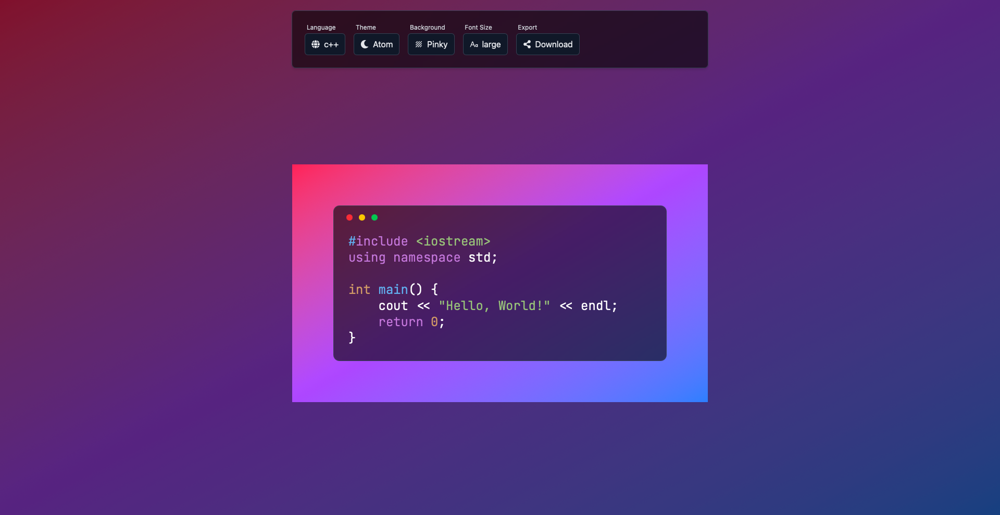
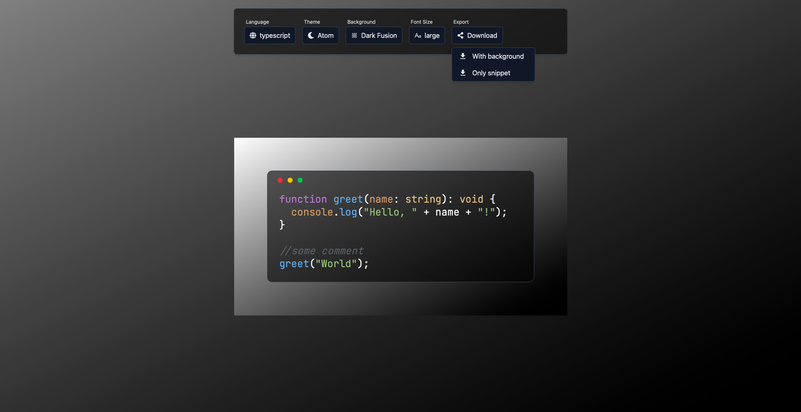

# CodeShareX

**CodeShareX** is a modern web application built with **React + TypeScript + TailwindCSS** that allows you to create code blocks and export them as images. Perfect for sharing code snippets on social media, presentations, or documentation.

---

## ✨ Features

- Create code blocks in your chosen programming language  
- Choose from multiple color themes and backgrounds  
- Adjust font size for readability  
- Export code with or without surrounding background
- Intuitive and fast user interface  

---

## Technologies

- **Frontend:** React, TypeScript  
- **Styling:** TailwindCSS  
- **Build Tool:** Vite

---

## Supported Languages

Some of supported languages:

- JavaScript  
- TypeScript  
- Python  
- Java  
- C++  
- GO
- Ruby
- HTML 

---

## How to Use

1. **Clone the repository:**
```bash
git clone https://github.com/jakub-dlu/codeShareX.git
```
2. **Install dependencies:**
```bash
npm install
```
3. **Run the application locally:**
```bash
npm run dev
```

## Screenshots


